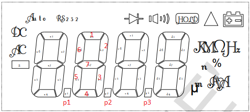
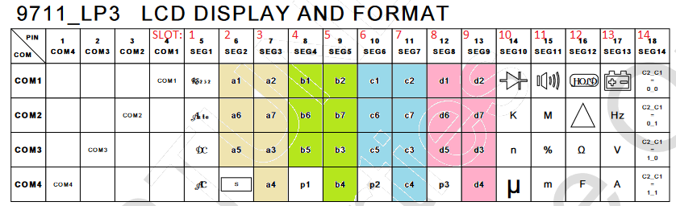

# ut60e: Python code for reading measurements via Pyserial
**UT60E UNI-T True-RMS Digital Multimeter w/ RS232**

## FS9721_LP3 : 4,000 counts auto range DMM IC Fortune Semiconductor Corp.

**Datasheet:** FS9721_LP3.pdf

### RS232 Transmission Protocol
 - Direction: One-way to computer.
 - Serial Transer Rate: 2400 bps
 - Data Bit: 8 bit.
 - Odd and Even Calibration: No
 - Data Decimal: Hex
 - Data Length: 14 Bytes.
 - Data Information: LCD table on-off information.
 - Data Format:
    1st byte → 1X (X is seg1, 4 bits represent the data on the LCD table)
    2nd byte → 2X (X is seg2, 4 bits represent the data on the LCD table)
    3rd byte → 3X (X is seg3, 4 bits represent the data on the LCD table)
    and so on
    1X → 4 bit， 2X→ 4 bit ， 3X→ 4 bit
    ...
    EXH → 4it
 -  X means: Bit3〜Bit 0→ segn (COM4―COM1)
 - Sampling Rate: 40kHz
 - ADC Output Frequency: 40Hz
 - ADC Output Frequency After Average: 10Hz
 - Output Frequency After Auto-Zero: 4Hz

 
